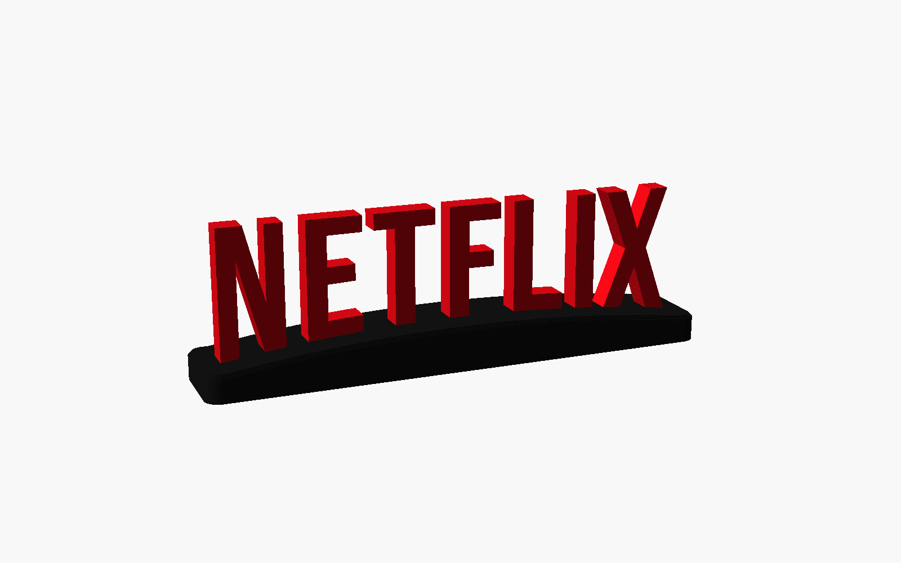
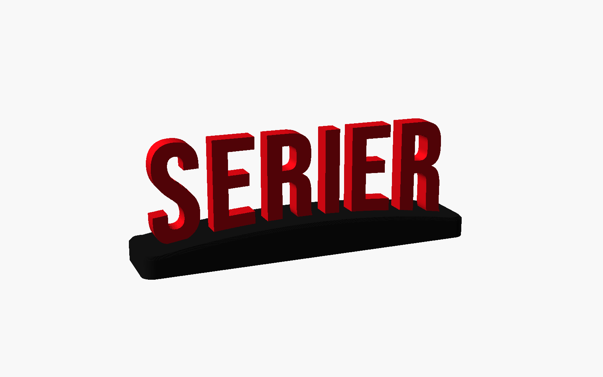
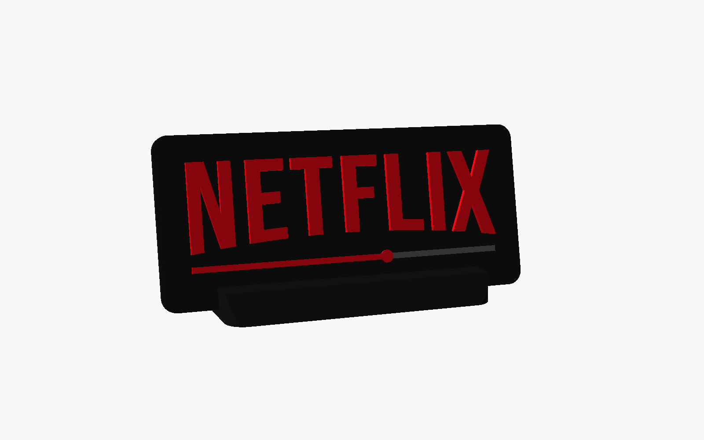
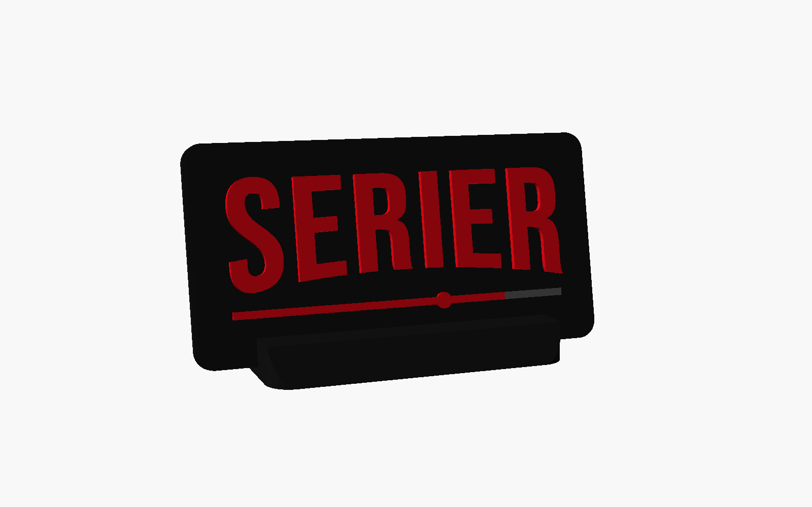
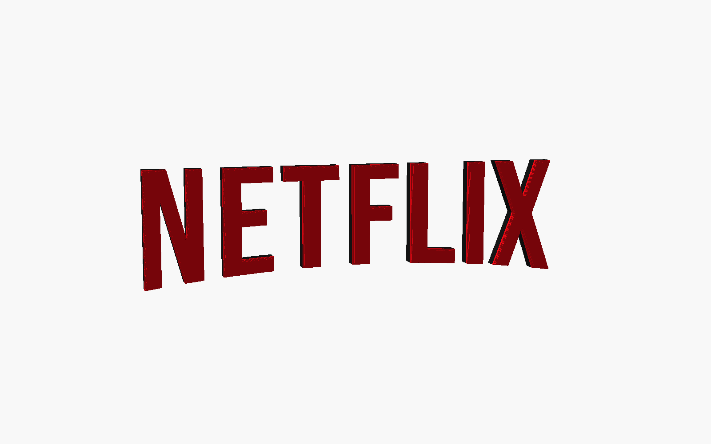
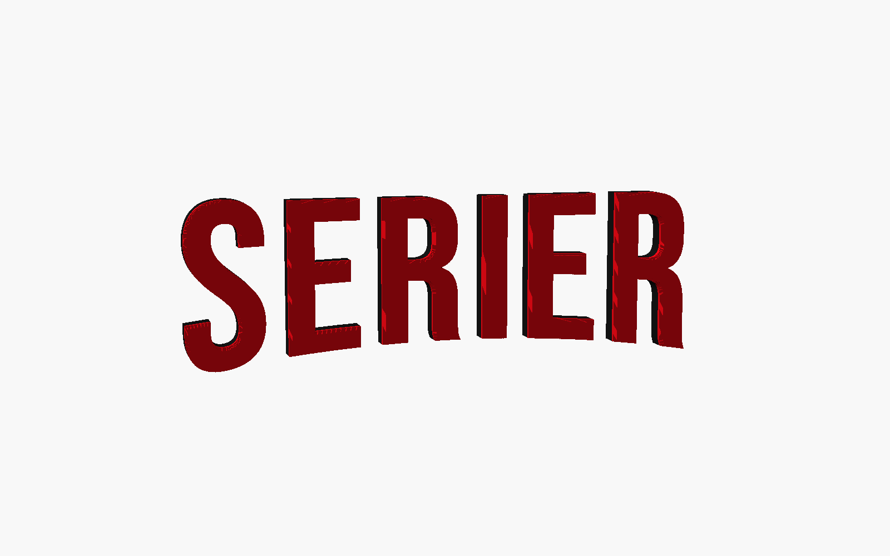

# Netflix-style lettering

Two exhibition pieces for a school library, `NETFLIX` and `SERIER`, in Netflix-style bent lettering. Each comes in three designs, and every file is ready to print on a Bambu Lab A1 mini (with or without an AMS lite) or an A2L Combo. Everything is parametric, so a new word, font or size is one setting away.

| | NETFLIX | SERIER |
|---|---|---|
| **Stand**: red letters on a black plinth that follows the arc |  |  |
| **Plaque**: black screen with raised letters and a Netflix progress bar, in a leaning stand |  |  |
| **Loose letters**: chunky two-tone letters for a wall or pinboard |  |  |

## Pick a file

Open the `.3mf` in Bambu Studio. The printer, plates, filaments, colours and any filament-swap pauses are already set, and every plate is sliced. For the plates, times and grams of each file, see [`docs/build-summary.md`](docs/build-summary.md).

| Design | A1 mini, no AMS (default) | A1 mini + AMS lite | A2L Combo (AMS lite) |
|---|---|---|---|
| Stand | [netflix](print-files/a1-mini/netflix-stand-a1-mini.3mf) · [serier](print-files/a1-mini/serier-stand-a1-mini.3mf) | [netflix](print-files/a1-mini-ams-lite/netflix-stand-a1-mini-ams-lite.3mf) · [serier](print-files/a1-mini-ams-lite/serier-stand-a1-mini-ams-lite.3mf) | [netflix](print-files/a2l-combo-ams-lite/netflix-stand-a2l-combo-ams-lite.3mf) · [serier](print-files/a2l-combo-ams-lite/serier-stand-a2l-combo-ams-lite.3mf) |
| Plaque | [netflix](print-files/a1-mini/netflix-plaque-a1-mini.3mf) · [serier](print-files/a1-mini/serier-plaque-a1-mini.3mf) | [netflix](print-files/a1-mini-ams-lite/netflix-plaque-a1-mini-ams-lite.3mf) · [serier](print-files/a1-mini-ams-lite/serier-plaque-a1-mini-ams-lite.3mf) | [netflix](print-files/a2l-combo-ams-lite/netflix-plaque-a2l-combo-ams-lite.3mf) · [serier](print-files/a2l-combo-ams-lite/serier-plaque-a2l-combo-ams-lite.3mf) |
| Loose letters | [netflix](print-files/a1-mini/netflix-letters-a1-mini.3mf) · [serier](print-files/a1-mini/serier-letters-a1-mini.3mf) | [netflix](print-files/a1-mini-ams-lite/netflix-letters-a1-mini-ams-lite.3mf) · [serier](print-files/a1-mini-ams-lite/serier-letters-a1-mini-ams-lite.3mf) | [netflix](print-files/a2l-combo-ams-lite/netflix-letters-a2l-combo-ams-lite.3mf) · [serier](print-files/a2l-combo-ams-lite/serier-letters-a2l-combo-ams-lite.3mf) |

Finished sizes (NETFLIX; SERIER is about 15 % narrower):

| Design | A1 mini files | A2L Combo files |
|---|---|---|
| Stand | 167 × 30 mm plinth, 42 mm letters, 51 mm tall | 301 × 50 mm plinth, 76 mm letters, 90 mm tall |
| Plaque | 155 × 69 mm, 36 mm letters | 295 × 126 mm, 70 mm letters |
| Loose letters | 75 mm tall, 294 mm wide on the wall | 120 mm tall, 458 mm wide on the wall |

All files use Bambu PLA Matte, the 0.20 mm Standard profile and the textured PEI plate. Any PLA works; pick a strong red (Netflix red is `#E50914`) and a black or charcoal.

## Printing and assembly

### No AMS: two A1 minis

Every A1 mini project has two plates, so both printers can run at once. In Bambu Studio, send plate 1 to one printer and plate 2 to the other.

- **Stand**: plate 1 is the letters, in red, printed face down so the textured plate gives them a crisp front. Plate 2 is the plinth, in black. Push each letter's tab into its pocket; it is a press fit with 0.15 mm clearance per side, and a drop of glue makes it permanent. About 50 min per printer.
- **Plaque**: plate 1 starts in black and **pauses at 4.2 mm**. On the printer, unload black, load red and resume. The letters and the filled part of the bar come out red; the rest of the bar stays a black groove. Plate 2 is the black stand. Slide the plaque into its leaning slot.
- **Loose letters**: both plates start in black and **pause at 7.2 mm**. Swap to red and resume, which gives black letters with a red face. For all-red letters, start with red and just resume at the pause, or delete the pause in Bambu Studio's preview.

### With an AMS lite (A1 mini + AMS lite, or the A2L Combo)

One plate, no manual swaps. Load red in the slot for filament 1 and black for filament 2. The plaque also uses grey as filament 3, for the bar's track.

- **Stand**: prints upright in one piece, running along the bed's Y axis so the thin letters are stiff against the moving bed. Tree supports hold up the arms of E, F and T and snap off their hidden undersides.
- **Plaque**: the plaque and its stand print together.
- **Loose letters**: black body with a red face. The AMS changes colour once per plate.

### Hanging the loose letters

Print the matching template from [`templates/`](templates) at 100 % scale (no "fit to page"). The A1 mini ones need A3, or A4 tiled; the A2L ones need tiling. Tape it to the wall, then place each letter on its outline. The line above the letters is the flat top edge; keep it level. Double-sided foam tape or poster putty holds the letters well. The model can also add a back recess for tape or magnet sheet (`letters_mount = "recess"`).

## Customise

Open `netflix-lettering.scad` in [OpenSCAD](https://openscad.org) and show **Window → Customizer**. The main settings:

| Setting | What it does |
|---|---|
| `text_string` | The text. Lowercase is turned into capitals (`force_caps`), and spaces and Norwegian letters work |
| `font_name` | Bebas Neue (default, closest to Netflix), Anton (heavier), League Gothic (narrower), or any installed font |
| `letter_height` | Height of the outer letters in mm; the width follows from the text |
| `arc_depth` | How much shorter the middle letters are (0 = straight, 0.134 = Netflix logo) |
| `letter_spacing`, `stroke_weight` | Tighter or looser spacing; bolder or thinner strokes |
| `design` | `stand`, `plaque` or `letters` |
| `part` | `display` for the coloured preview; the other values output one print part laid out for printing |

Each design has its own group of settings: plinth size, chamfers, letter depth, plaque margins, progress-bar fill, stand tilt, mounting recess and so on. Every setting has a comment in the file.

A full render takes 5–20 s.

To get your own text into Bambu Studio, you have two options:

- **One part at a time**: set `part` (for example `letters` and then `base` for the stand), press F6 and export each as STL.
- **Whole projects**: edit `TEXTS` (and `SIZES` if needed) at the top of [`tools/build.py`](tools/build.py) and run it (see below). You get the same ready-to-print projects as here, for every printer setup.

On **MakerWorld's Parametric Model Maker**, use [`makerworld/netflix-lettering-makerworld.scad`](makerworld/netflix-lettering-makerworld.scad), not the desktop file. It's generated from the desktop file and tested on MakerWorld.

- **Plates:** its 3MF has two plates, one per printer, in the right colours: stand letters and plinth, plaque and its stand, or the loose letters split in two. Set `makerworld_stand = "one piece"` for the upright AMS stand.
- **Fonts:** you get MakerWorld's font picker with 500+ Google Fonts; Bebas Neue is among them.
- **Before printing a MakerWorld 3MF:** switch the plate type to **Textured PEI Plate** in Bambu Studio. MakerWorld defaults to Cool Plate, which heats the bed to only 35 °C.
- **No pauses:** MakerWorld can't add filament-swap pauses, so the plaque and loose letters need an AMS for two colours. For the no-AMS two-colour versions, use the files in `print-files/`.

The desktop file uses no experimental OpenSCAD features, so it runs in the stock Customizer too.

## Rebuilding the print files

```bash
python3 tools/build.py                                   # everything, about 4 minutes
python3 tools/build.py --only serier --only 'a1-mini$'   # a subset
python3 tools/build.py --list                            # all variant keys
```

Needs OpenSCAD (a 2025+ snapshot with the Manifold backend is much faster than 2021.01) and Bambu Studio in `/Applications` (tested with 02.08.02.61). For every variant the script:

1. exports the parts,
2. lays out the plates,
3. builds the project with Bambu Studio's CLI and adds the pauses,
4. slices every plate with the stock Bambu profiles.

It refuses to write a project unless all of these hold:

- no stray mesh slivers,
- the real printer start G-code is present,
- each plate uses the right filament,
- pauses are at the exact layer.

Plate previews, the build summary, templates and renders in `docs/` are regenerated too.

## How the Netflix look is made

The Netflix wordmark is custom lettering, and Netflix Sans isn't free. So this uses **Bebas Neue**, a free font (SIL OFL) whose letter widths match the logo's within about 2 % of the letter height. It is then bent like the logo:

- the top edge stays flat;
- the bottom edge follows a parabola, so the middle letters are 13.4 % shorter than the outer ones.

Those numbers, and letter spacing 1.08, were measured and fitted against the real logo. For the measurements, the font comparison and the geometry tricks that keep the model customisable without experimental OpenSCAD features, see [`docs/design-notes.md`](docs/design-notes.md).

## Files

```
netflix-lettering/
├── netflix-lettering.scad      # the parametric model
├── fonts/                      # Bebas Neue, Anton, League Gothic + their OFL licences
├── print-files/
│   ├── a1-mini/                # no AMS: two plates per project, manual swaps where needed
│   ├── a1-mini-ams-lite/       # A1 mini with AMS lite: one plate, automatic colours
│   └── a2l-combo-ams-lite/     # A2L Combo: bigger versions, automatic colours
├── makerworld/                 # MakerWorld Parametric Model Maker edition (generated)
├── templates/                  # 1:1 wall templates for the loose letters (SVG)
├── docs/
│   ├── design-notes.md         # research, measurements, techniques
│   ├── build-summary.md        # every project: plates, times, grams (generated)
│   └── images/                 # renders and Bambu plate previews (generated)
└── tools/build.py              # regenerates print-files/, templates/ and docs/
```

## Licence and trademarks

The model, build script and print files are [AGPL-3.0](../LICENSE). The fonts in `fonts/` are under the SIL Open Font License 1.1 and belong to their authors (see the `OFL-*.txt` files).

Netflix is a trademark of Netflix, Inc. This is an independent, fan-made lookalike for a school library display. It is not affiliated with or endorsed by Netflix, and it contains no Netflix artwork: the lettering is a free font bent to a similar shape.
